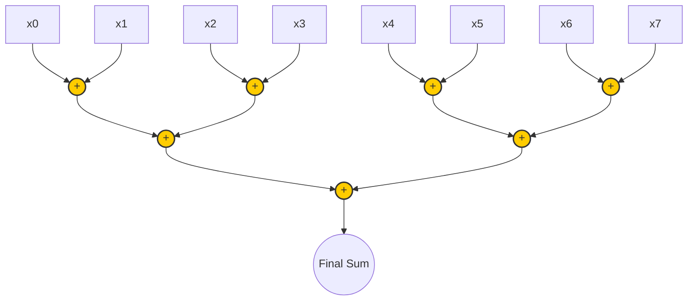
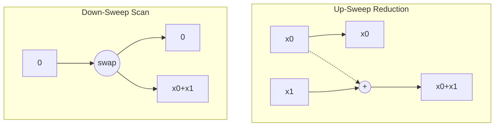

# Data Parallel Programming using CUDA: Case Studies

This repository contains materials, explanations, and core CUDA kernels for fundamental data-parallel algorithms. It is designed to serve as a resource for exploring GPU architecture and the CUDA computation model through practical case studies.

---

## 1. Basic Operations: Reduction and Prefix Sum

### 1.1 Parallel Reduction(also known as Fold)

Parallel reduction is a fundamental operation where we combine an array of elements into a single value (e.g., sum, max, min). 


 **Apply binary operation f to each element and an accumulated value**

* **Seeded by initial value of type b**

`f :: (b,a) -> b`

`fold :: b -> ((b,a) -> b) -> seq a -> b`

**Annotations for the `fold` signature:**

* `b` (first argument): Initial element
* `((b,a) -> b)`: Function to fold
* `seq a`: Input sequence
* `b` (return value): Output


#### Tree-Based Approach
In a parallel tree-based reduction, multiple threads pair up adjacent elements and combine them. In each step, the number of active threads halves, forming an inverted tree. This reduces the time complexity from $O(N)$ (sequential) to $O(\log N)$ (parallel).



#### CUDA Core Loop (Pseudocode)

```cpp
// Kernel Core Loop for Shared Memory Reduction
for (unsigned int s = blockDim.x / 2; s > 0; s >>= 1) {
    if (tid < s) {
        shared_data[tid] += shared_data[tid + s];
    }
    __syncthreads(); // Ensure all additions in this step are complete
}
// Thread 0 writes the block's partial sum to global memory
if (tid == 0) out[blockIdx.x] = shared_data[0];
```

---

### 1.2 Parallel Prefix Sum (Scan)

A prefix sum (or scan) takes an input array and produces an output array where each element is the sum of all preceding elements.

#### A. Naive / Step-Efficient Scan (Hillis-Steele)
This approach is highly parallel and easy to understand but **not work-efficient**. It performs $O(N \log N)$ operations compared to a sequential CPU's $O(N)$.

**Illustration:**
At step $d$, each thread $i$ adds the element at $i - 2^{(d-1)}$ to its own element.

```text
Step 0: [ 1 ]  [ 2 ]  [ 3 ]  [ 4 ]
Step 1: [ 1 ]  [1+2]  [2+3]  [3+4]  (distance 1)
Step 2: [ 1 ]  [ 3 ]  [1+5]  [3+7]  (distance 2)
--------------------------------------
Result: [ 1 ]  [ 3 ]  [ 6 ]  [ 10]
```

**CUDA Core Loop (Hillis-Steele):**
```cpp
for (int d = 1; d < n; d *= 2) {
    int val = 0;
    if (tid >= d) {
        val = shared_data[tid - d];
    }
    __syncthreads();
    shared_data[tid] += val;
    __syncthreads();
}
```


#### B. Work-Efficient Scan (Blelloch)
This approach uses a two-phase tree execution, performing $O(N)$ operations (matching a sequential CPU approach), making it truly work-efficient.

**Illustration:**
1. **Up-Sweep (Reduce Phase):** Builds a partial sum tree.
2. **Down-Sweep Phase:** Replaces the root with 0 and traverses back down, swapping and adding to compute running sums.



**CUDA Core Loop (Blelloch):**
```cpp
// 1. Up-sweep (Reduce) phase
for (int d = 1; d < n; d *= 2) {
    int index = (tid + 1) * d * 2 - 1;
    if (index < n) {
        shared_data[index] += shared_data[index - d];
    }
    __syncthreads();
}

if (tid == 0) shared_data[n - 1] = 0; // Set root to zero
__syncthreads();

// 2. Down-sweep phase
for (int d = n / 2; d > 0; d /= 2) {
    int index = (tid + 1) * d * 2 - 1;
    if (index < n) {
        float temp = shared_data[index - d];
        shared_data[index - d] = shared_data[index];
        shared_data[index] += temp;
    }
    __syncthreads();
}
```

---

## 2. Vector Operations

### 2.1 Vector Dot Product

The dot product of two vectors involves element-wise multiplication followed by a reduction (summation) of the products.

**CUDA Core Loop (Dot Product):**
```cpp
// 1. Element-wise multiplication into shared memory
int idx = blockIdx.x * blockDim.x + threadIdx.x;
if (idx < N) {
    shared_data[tid] = A[idx] * B[idx];
} else {
    shared_data[tid] = 0.0f; // Handle boundaries
}
__syncthreads();

// 2. Tree-based Parallel Reduction (same as above)
for (unsigned int s = blockDim.x / 2; s > 0; s >>= 1) {
    if (tid < s) shared_data[tid] += shared_data[tid + s];
    __syncthreads();
}

// 3. Atomically add block results to a global accumulator
if (tid == 0) atomicAdd(final_result, shared_data[0]);
```

---

## 3. Matrix Operations

### 3.1 Matrix-Vector Product

Multiply a matrix $\mathbf{A}$ (dimensions $M \times N$) by a vector $\mathbf{x}$ (dimension $N$) to yield a vector $\mathbf{y}$ (dimension $M$).

**Illustration:**
Each row of the matrix is multiplied element-wise by the vector, and the results are summed. In CUDA, a standard approach maps one thread to one row of the matrix.

```text
       Matrix A         Vector x     Vector y
[ a00, a01, a02 ]   *   [ x0 ]   =   [ y0 ]
[ a10, a11, a12 ]       [ x1 ]       [ y1 ]
[ a20, a21, a22 ]       [ x2 ]       [ y2 ]
```

**CUDA Core Loop:**
```cpp
int row = blockIdx.x * blockDim.x + threadIdx.x;
if (row < M) {
    float dot_product = 0.0f;
    for (int col = 0; col < N; ++col) {
        dot_product += A[row * N + col] * x[col];
    }
    y[row] = dot_product;
}
```

---

### 3.2 Matrix-Matrix Product

Multiply matrix $\mathbf{A}$ ($M \times K$) and matrix $\mathbf{B}$ ($K \times N$) to yield matrix $\mathbf{C}$ ($M \times N$). Since global memory accesses are slow, a tiled approach using fast shared memory is heavily preferred.

*(Concepts and tiling illustrations are referenced from NVIDIA developer resources like "Efficient Matrix Multiplication using Shared Memory".)*

**Illustration (Tiled Execution):**
Instead of loading the entire row of A and column of B for every element of C, we divide A and B into smaller sub-matrices (tiles) that fit into shared memory. Threads in a block collaborate to load a tile, compute partial sums, and advance to the next tile.

```text
Matrix C tile (Block) is computed by iterating over corresponding tiles of A and B.

[ Tile C ] += [ Tile A_0 ] * [ Tile B_0 ]
[ Tile C ] += [ Tile A_1 ] * [ Tile B_1 ]
...
```

**CUDA Core Loop (Tiled Matrix Multiplication):**
```cpp
// Allocate shared memory for tiles
__shared__ float Asub[TILE_SIZE][TILE_SIZE];
__shared__ float Bsub[TILE_SIZE][TILE_SIZE];

int row = blockIdx.y * TILE_SIZE + threadIdx.y;
int col = blockIdx.x * TILE_SIZE + threadIdx.x;

float Cvalue = 0.0f;

// Loop over all tiles required to compute the C element
for (int t = 0; t < (K + TILE_SIZE - 1) / TILE_SIZE; ++t) {
    
    // 1. Collaborative loading into shared memory with bounds tracking
    if (row < M && t * TILE_SIZE + threadIdx.x < K)
        Asub[threadIdx.y][threadIdx.x] = A[row * K + t * TILE_SIZE + threadIdx.x];
    else 
        Asub[threadIdx.y][threadIdx.x] = 0.0f;

    if (t * TILE_SIZE + threadIdx.y < K && col < N)
        Bsub[threadIdx.y][threadIdx.x] = B[(t * TILE_SIZE + threadIdx.y) * N + col];
    else 
        Bsub[threadIdx.y][threadIdx.x] = 0.0f;
        
    __syncthreads(); // Wait for tile to load

    // 2. Compute partial dot product for this tile
    for (int k = 0; k < TILE_SIZE; ++k) {
        Cvalue += Asub[threadIdx.y][k] * Bsub[k][threadIdx.x];
    }
    __syncthreads(); // Wait for computation before loading next tile
}

// 3. Write final result to global memory
if (row < M && col < N) {
    C[row * N + col] = Cvalue;
}
```

*Note: The fundamental explanations for tiled matrix multiplication, tree-based scans, and work-efficiency principles are established heavily upon NVIDIA's GPU Gems, CUDA Programming Guides, and seminal work by Mark Harris.*