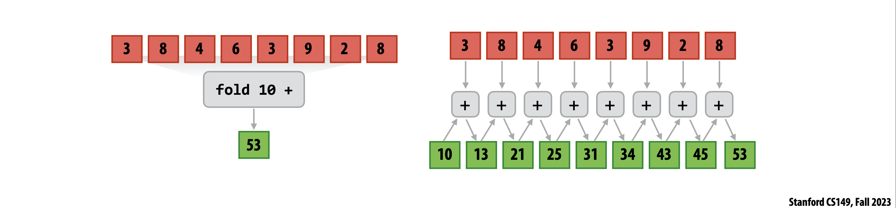
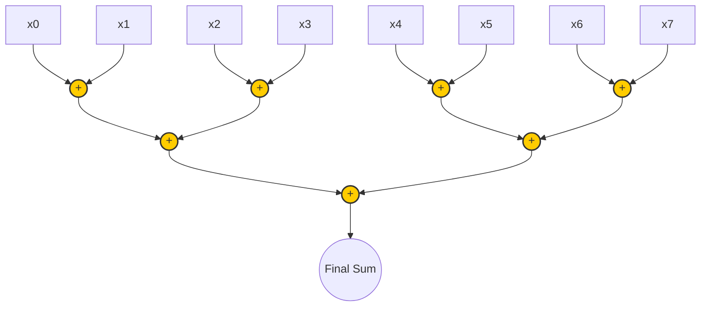
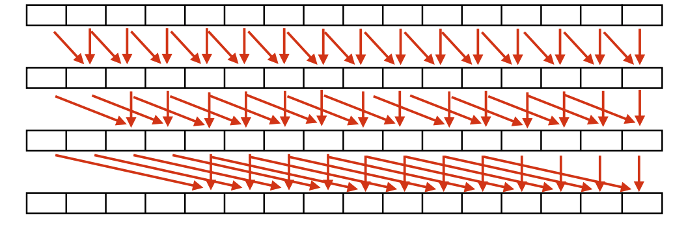
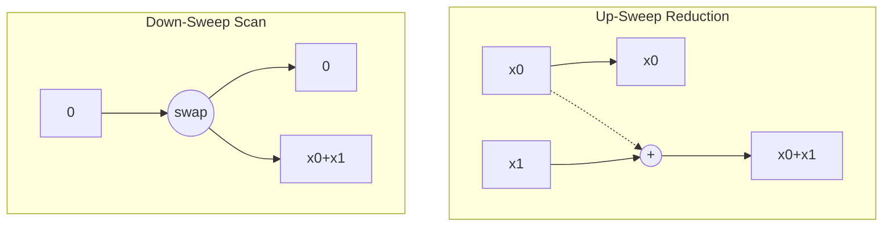
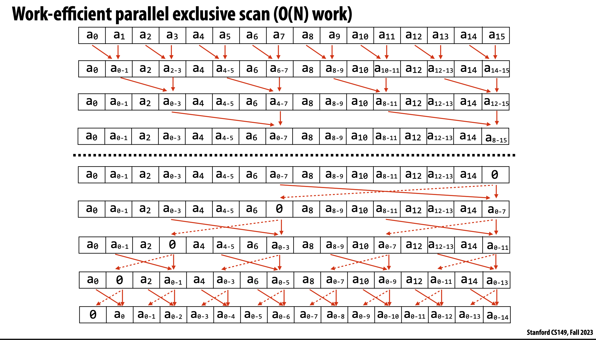
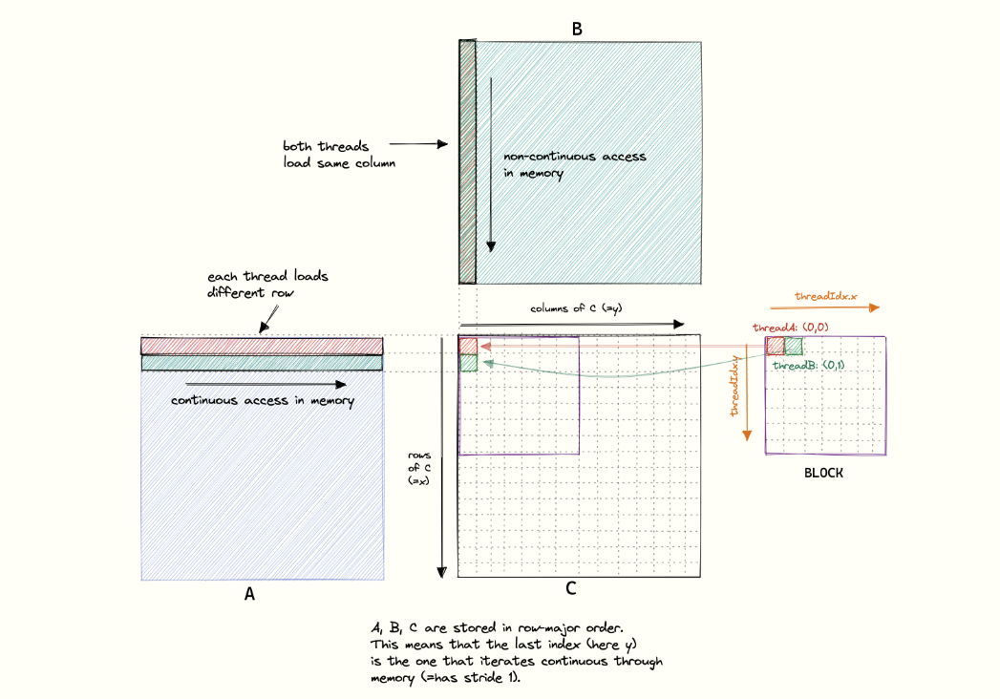
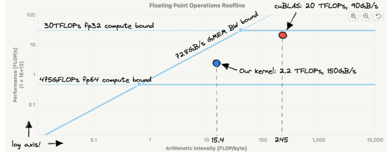
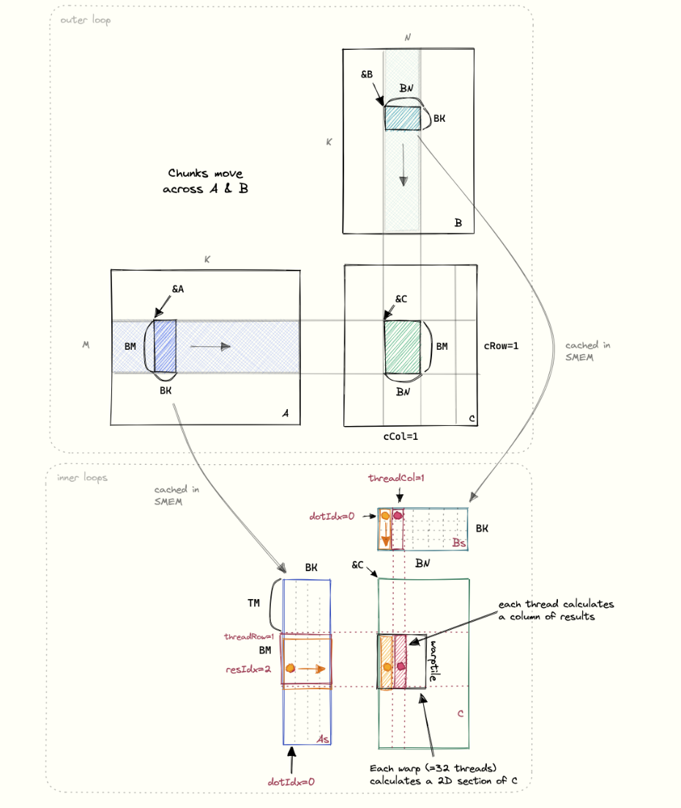

# Data Parallel Programming using CUDA: Case Studies

This repository contains materials, explanations, and core CUDA kernels for fundamental data-parallel algorithms. It is designed to serve as a resource for exploring GPU architecture and the CUDA computation model through practical case studies.

---

## 1. Basic Operations: Reduction and Prefix Sum

### 1.1 Parallel Reduction(also known as Fold)

Parallel reduction is a fundamental operation where we combine an array of elements into a single value (e.g., sum, max, min). 


 **Apply binary operation f to each element and an accumulated value**

* **Seeded by initial value of type b**

`f :: (b,a) -> b`

`fold :: b -> ((b,a) -> b) -> seq a -> b`

**Annotations for the `fold` signature:**

* `b` (first argument): Initial element
* `((b,a) -> b)`: Function to fold
* `seq a`: Input sequence
* `b` (return value): Output




#### Tree-Based Approach
In a parallel tree-based reduction, multiple threads pair up adjacent elements and combine them. In each step, the number of active threads halves, forming an inverted tree. This reduces the time complexity from $O(N)$ (sequential) to $O(\log N)$ (parallel).



#### CUDA Core Loop (Pseudocode)

```cpp
// Kernel Core Loop for Shared Memory Reduction
for (unsigned int s = blockDim.x / 2; s > 0; s >>= 1) {
    if (tid < s) {
        shared_data[tid] += shared_data[tid + s];
    }
    __syncthreads(); // Ensure all additions in this step are complete
}
// Thread 0 writes the block's partial sum to global memory
if (tid == 0) out[blockIdx.x] = shared_data[0];
```

---

### 1.2 Parallel Prefix Sum (Scan)

A prefix sum (or scan) takes an input array and produces an output array where each element is the sum of all preceding elements.

#### A. Naive / Step-Efficient Scan (Hillis-Steele)
This approach is highly parallel and easy to understand but **not work-efficient**. It performs $O(N \log N)$ operations compared to a sequential CPU's $O(N)$.

**Illustration:**
At step $d$, each thread $i$ adds the element at $i - 2^{(d-1)}$ to its own element.

```text
Step 0: [ 1 ]  [ 2 ]  [ 3 ]  [ 4 ]
Step 1: [ 1 ]  [1+2]  [2+3]  [3+4]  (distance 1)
Step 2: [ 1 ]  [ 3 ]  [1+5]  [3+7]  (distance 2)
--------------------------------------
Result: [ 1 ]  [ 3 ]  [ 6 ]  [ 10]
```

**CUDA Core Loop (Hillis-Steele):**
```cpp
for (int d = 1; d < n; d *= 2) {
    int val = 0;
    if (tid >= d) {
        val = shared_data[tid - d];
    }
    __syncthreads();
    shared_data[tid] += val;
    __syncthreads();
}
```


#### B. Work-Efficient Scan (Blelloch)
This approach uses a two-phase tree execution, performing $O(N)$ operations (matching a sequential CPU approach), making it truly work-efficient.

**Illustration:**
1. **Up-Sweep (Reduce Phase):** Builds a partial sum tree.
2. **Down-Sweep Phase:** Replaces the root with 0 and traverses back down, swapping and adding to compute running sums.



**CUDA Core Loop (Blelloch):**
```cpp
// 1. Up-sweep (Reduce) phase
for (int d = 1; d < n; d *= 2) {
    int index = (tid + 1) * d * 2 - 1;
    if (index < n) {
        shared_data[index] += shared_data[index - d];
    }
    __syncthreads();
}

if (tid == 0) shared_data[n - 1] = 0; // Set root to zero
__syncthreads();

// 2. Down-sweep phase
for (int d = n / 2; d > 0; d /= 2) {
    int index = (tid + 1) * d * 2 - 1;
    if (index < n) {
        float temp = shared_data[index - d];
        shared_data[index - d] = shared_data[index];
        shared_data[index] += temp;
    }
    __syncthreads();
}
```

---

## 2. Vector Operations

### 2.1 Vector Dot Product

The dot product of two vectors involves element-wise multiplication followed by a reduction (summation) of the products.

**CUDA Core Loop (Dot Product):**
```cpp
// 1. Element-wise multiplication into shared memory
int idx = blockIdx.x * blockDim.x + threadIdx.x;
if (idx < N) {
    shared_data[tid] = A[idx] * B[idx];
} else {
    shared_data[tid] = 0.0f; // Handle boundaries
}
__syncthreads();

// 2. Tree-based Parallel Reduction (same as above)
for (unsigned int s = blockDim.x / 2; s > 0; s >>= 1) {
    if (tid < s) shared_data[tid] += shared_data[tid + s];
    __syncthreads();
}

// 3. Atomically add block results to a global accumulator
if (tid == 0) atomicAdd(final_result, shared_data[0]);
```

---

## 3. Matrix Operations

### 3.1 Matrix-Vector Product

Multiply a matrix $\mathbf{A}$ (dimensions $M \times N$) by a vector $\mathbf{x}$ (dimension $N$) to yield a vector $\mathbf{y}$ (dimension $M$).

**Illustration:**
```text
       Matrix A         Vector x     Vector y
[ a00, a01, a02 ]   *   [ x0 ]   =   [ y0 ]
[ a10, a11, a12 ]       [ x1 ]       [ y1 ]
[ a20, a21, a22 ]       [ x2 ]       [ y2 ]
```

---

#### V1 — Naive: One Thread Per Row

Each thread independently computes the full dot product for one row, reading all of `A` and `x` from global memory.

```cpp
int row = blockIdx.x * blockDim.x + threadIdx.x;
if (row < M) {
    float dot = 0.0f;
    for (int col = 0; col < N; ++col) {
        dot += A[row * N + col] * x[col];
    }
    y[row] = dot;
}
```

**Bottleneck:** Every thread independently loads the full vector `x` from slow global memory — `x` is read $M$ times in total. For large $M$ and $N$, this is extremely bandwidth-wasteful.

---

#### V2 — Cache `x` in Shared Memory (Tiled)

All threads in a block collaborate to load a tile of `x` into shared memory once, then reuse it for all rows in the block. `x` is now read once per block per tile instead of once per thread.

```cpp
__shared__ float x_shared[TILE_SIZE];

int row = blockIdx.x * blockDim.x + threadIdx.x;
float dot = 0.0f;

// Process x in tiles
for (int t = 0; t < (N + TILE_SIZE - 1) / TILE_SIZE; ++t) {

    // Collaboratively load one tile of x into shared memory
    int x_idx = t * TILE_SIZE + threadIdx.x;
    x_shared[threadIdx.x] = (x_idx < N) ? x[x_idx] : 0.0f;
    __syncthreads();

    // Each thread accumulates using the cached tile
    if (row < M) {
        for (int col = 0; col < TILE_SIZE; ++col) {
            int global_col = t * TILE_SIZE + col;
            if (global_col < N)
                dot += A[row * N + global_col] * x_shared[col];
        }
    }
    __syncthreads();
}

if (row < M) y[row] = dot;
```

**Improvement:** `x` is loaded from global memory only once per block per tile (not once per thread). Global memory traffic for `x` is reduced by a factor of `blockDim.x`.

**Remaining bottleneck:** Each thread still loads its row of `A` alone. For very wide matrices (large $N$), the dot product could be parallelised across threads too.

---

#### V3 — 2D Parallelism: Threads Collaborate on Each Row's Dot Product

Use a 2D thread block: threads along the x-dimension split the columns of a row and compute partial sums in parallel, which are then reduced in shared memory. One block handles one row.

```cpp
// Launch config: <<<M, BLOCK_COLS>>>  (one block per row, BLOCK_COLS threads per block)
__shared__ float partial[BLOCK_COLS];

int row = blockIdx.x;
int tid = threadIdx.x;

// Each thread strides across columns, accumulating a partial sum
float sum = 0.0f;
for (int col = tid; col < N; col += BLOCK_COLS) {
    sum += A[row * N + col] * x[col];
}
partial[tid] = sum;
__syncthreads();

// Tree-based reduction within the block to get the final dot product
for (unsigned int s = BLOCK_COLS / 2; s > 0; s >>= 1) {
    if (tid < s) partial[tid] += partial[tid + s];
    __syncthreads();
}

// Thread 0 writes the final result
if (tid == 0) y[row] = partial[0];
```

**Improvement:** The dot product for each row is now computed in parallel by `BLOCK_COLS` threads, reducing per-row latency from $O(N)$ to $O(N / \text{BLOCK\_COLS})$ compute steps plus $O(\log \text{BLOCK\_COLS})$ for the reduction. This is the standard high-performance approach for matrix-vector products on wide matrices.

**Summary of progression:**

| Version | x loaded from global memory | Parallelism |
|---|---|---|
| V1 Naive | $M \times$ (once per thread) | 1 thread per row |
| V2 Tiled x | Once per block per tile | 1 thread per row |
| V3 2D parallel | Once per block per tile | All threads per row |

---

### 3.2 Matrix-Matrix Product


## CUDA Matrix-Matrix Multiplication (SGEMM) Optimization

Matrix multiplication is heavily memory-bound and compute-intensive. This section breaks down the iterative optimization of a Single-Precision Matrix Multiplication (SGEMM) kernel in CUDA, stepping from a basic implementation towards cuBLAS-like performance by leveraging memory hierarchies, caching, and arithmetic intensity.

### Kernel 1: Naive Implementation

In the standard CUDA hierarchy, we assign each thread in a 2D block to compute exactly *one* element of the output matrix $C$. The thread loops over the corresponding row of $A$ and column of $B$, computing the dot product and writing the result.

* **The Bottleneck:** Threads within the same warp (32 consecutive threads) read contiguous elements of $B$, but they read non-contiguous elements of $A$. This lack of spatial locality causes the GPU to issue many tiny, separate memory transactions, severely choking global memory (GMEM) bandwidth.
![* `\[Placeholder for Image: Visualization of Naive Memory Access Pattern mapping threads to Matrix A and B\]`](images/naiveK1.png)


```cpp
// Kernel 1: Naive 1 thread = 1 element
int x = blockIdx.x * blockDim.x + threadIdx.x; // Row index
int y = blockIdx.y * blockDim.y + threadIdx.y; // Col index

if (x < M && y < N) {
    float tmp = 0.0;
    for (int i = 0; i < K; ++i) {
        // Uncoalesced access on A for adjacent threads in a warp
        tmp += A[x * K + i] * B[i * N + y]; 
    }
    C[x * N + y] = alpha * tmp + beta * C[x * N + y];
}

```
#### Memory Access Pattern:

### Kernel 2: Global Memory Coalescing

To maximize global memory throughput, memory accesses by threads in the same warp must be **coalesced** (combined into a single, wide 128-byte transaction).

* **The Optimization:** We change the index mapping. We assign threads to the output matrix $C$ such that adjacent threads in a warp access continuous memory blocks in *both* $A$ and $B$.
* **The Result:** The hardware can now group the memory loads. This drastically reduces the total number of memory transactions, though the kernel is still fundamentally bottlenecked by the sheer volume of GMEM reads.
* ![`\[Placeholder for Image: Visualization of Coalesced vs. Non-Coalesced Global Memory Accesses in a Warp\]`](images/k2.png)

```cpp
// Kernel 2: Remapping thread IDs to ensure memory coalescing
// threadIdx.x is contiguous, so we map it to the contiguous dimension
const int x = blockIdx.x * BLOCKSIZE + (threadIdx.x / BLOCKSIZE);
const int y = blockIdx.y * BLOCKSIZE + (threadIdx.x % BLOCKSIZE);

if (x < M && y < N) {
    float tmp = 0.0;
    for (int i = 0; i < K; ++i) {
        // Access pattern is now coalesced for both A and B
        tmp += A[x * K + i] * B[i * N + y];
    }
    C[x * N + y] = alpha * tmp + beta * C[x * N + y];
}

```

### Kernel 3: Shared Memory (SMEM) Caching

Even with coalesced accesses, fetching from global memory for every math operation is far too slow. We need to reuse data.

* **The Optimization:** We utilize Shared Memory (SMEM)—a very fast, user-managed, on-chip cache shared by all threads in a block. We load small "tiles" (e.g., 32x32 blocks) of $A$ and $B$ from GMEM into SMEM. Threads synchronize (`__syncthreads()`) to ensure the tile is fully loaded, compute their partial dot products using the SMEM tile, and then slide to the next tile.
* **The Result:** We dramatically reduce redundant global memory accesses. The bottleneck now shifts from Global Memory bandwidth to Shared Memory bandwidth.
* ![`\[Placeholder for Image: Visualization of Block Tiling and Shared Memory Caching stages\]`](images/kernel3.png)

```cpp
// Kernel 3: SMEM Caching (Tiling)
__shared__ float As[BLOCKSIZE * BLOCKSIZE];
__shared__ float Bs[BLOCKSIZE * BLOCKSIZE];

const int threadRow = threadIdx.x / BLOCKSIZE;
const int threadCol = threadIdx.x % BLOCKSIZE;

// advance pointers to the starting positions
A += cRow * BLOCKSIZE * K;                          // row=cRow, col=0
B += cCol * BLOCKSIZE;                              // row=0, col=cCol
C += cRow * BLOCKSIZE * N + cCol * BLOCKSIZE;       // row=cRow, col=cCol

float tmp = 0.0;
// the outer loop advances A along the columns and B along
// the rows until we have fully calculated the result in C.
for (int bkIdx = 0; bkIdx < K; bkIdx += BLOCKSIZE) {
    // Have each thread load one of the elements in A & B from
    // global memory into shared memory.
    // Make the threadCol (=threadIdx.x) the consecutive index
    // to allow global memory access coalescing
    As[threadRow * BLOCKSIZE + threadCol] = A[threadRow * K + threadCol];
    Bs[threadRow * BLOCKSIZE + threadCol] = B[threadRow * N + threadCol];

    // block threads in this block until cache is fully populated
    __syncthreads();

    // advance pointers onto next chunk
    A += BLOCKSIZE;
    B += BLOCKSIZE * N;

    // execute the dot product on the currently cached block
    for (int dotIdx = 0; dotIdx < BLOCKSIZE; ++dotIdx) {
        tmp += As[threadRow * BLOCKSIZE + dotIdx] *
               Bs[dotIdx * BLOCKSIZE + threadCol];
    }
    // need to sync again at the end, to avoid faster threads
    // fetching the next block into the cache before slower threads are done
    __syncthreads();
}
C[threadRow * N + threadCol] =
    alpha * tmp + beta * C[threadRow * N + threadCol];
```

### Kernel 4: 1D Blocktiling (Multiple Results per Thread)

To reduce the strain on Shared Memory, we must handle more work in the fastest memory space available: thread-local registers.

* **The Optimization:** Instead of computing a single element of $C$, each thread calculates a 1D column (or row) of multiple elements (e.g., 8 elements). A thread can now load a single value of $B$ from SMEM, cache it in a local register, and reuse it across 8 distinct calculations with $A$.
* **The Result:** SMEM loads are slashed significantly, making the kernel roughly twice as fast as Kernel 3.
* 

```cpp
// Launch config: sgemm_1d_blocktile<<<grid, BM/TM * BN>>>(...)  where
//   dim3 grid((M + BM-1)/BM, (N + BN-1)/BN)
__global__ void sgemm_1d_blocktile(float *A, float *B, float *C,
                                    int M, int N, int K,
                                    float alpha, float beta) {
    __shared__ float As[BM * BK];
    __shared__ float Bs[BK * BN];

    // Each thread handles TM rows within its column
    const uint threadCol = threadIdx.x % BN;
    const uint threadRow = threadIdx.x / BN;

    // Indices used to load tiles from GMEM into SMEM
    const uint innerRowA = threadIdx.x / BK;
    const uint innerColA = threadIdx.x % BK;
    const uint innerRowB = threadIdx.x / BN;
    const uint innerColB = threadIdx.x % BN;

    // Advance pointers to this block's starting tile
    A += blockIdx.y * BM * K;
    B += blockIdx.x * BN;
    C += blockIdx.y * BM * N + blockIdx.x * BN;

    float threadResults[TM] = {0.0}; // Stored in ultra-fast registers

    for (uint bkIdx = 0; bkIdx < K; bkIdx += BK) {
        // Collaboratively load tiles of A and B into SMEM
        As[innerRowA * BK + innerColA] = A[innerRowA * K + innerColA];
        Bs[innerRowB * BN + innerColB] = B[innerRowB * N + innerColB];
        __syncthreads();

        // Advance pointers to next tile
        A += BK;
        B += BK * N;

        // Compute TM results per thread
        for (uint dotIdx = 0; dotIdx < BK; ++dotIdx) {
            float Btmp = Bs[dotIdx * BN + threadCol]; // Cache B value in a register for reuse
            for (uint resIdx = 0; resIdx < TM; ++resIdx) {
                // Reuse Btmp TM times against different rows of A
                threadResults[resIdx] += As[(threadRow * TM + resIdx) * BK + dotIdx] * Btmp;
            }
        }
        __syncthreads();
    }

    // Write TM results back to global memory
    for (uint resIdx = 0; resIdx < TM; ++resIdx) {
        C[(threadRow * TM + resIdx) * N + threadCol] =
            alpha * threadResults[resIdx] +
            beta  * C[(threadRow * TM + resIdx) * N + threadCol];
    }
}
```

### Kernel 5: 2D Blocktiling (Increasing Arithmetic Intensity)

We can push register reuse even further by calculating a 2D grid instead of a 1D line.

* **The Optimization:** Each thread is now responsible for a 2D grid of elements (e.g., an 8x8 sub-grid of $C$). The thread loads 8 elements of $A$ and 8 elements of $B$ into its registers. By performing an outer product on these registers, it can compute 64 results.
* **The Result:** The arithmetic intensity (ratio of FLOPs to memory loads) skyrockets. We are finally moving the kernel from being memory-bound to being compute-bound.
![* `\[Placeholder for Image: Visualization of 2D Thread Tiling showing the outer product calculation in registers\]`](images/kernel5.png)

```cpp
// Kernel 5: 2D Blocktiling (e.g., TM = 8, TN = 8)
float threadResults[TM * TN] = {0.0}; 
float regM[TM] = {0.0}; // Register cache for A
float regN[TN] = {0.0}; // Register cache for B

for (uint bkIdx = 0; bkIdx < K; bkIdx += BK) {
    // ... Populate SMEM tiles As and Bs ...
    __syncthreads();

    for (uint dotIdx = 0; dotIdx < BK; ++dotIdx) {
        // Load chunks from SMEM directly into Registers
        for (uint i = 0; i < TM; ++i) regM[i] = As[...];
        for (uint i = 0; i < TN; ++i) regN[i] = Bs[...];
        
        // Perform Outer Product strictly in registers
        for (uint resIdxM = 0; resIdxM < TM; ++resIdxM) {
            for (uint resIdxN = 0; resIdxN < TN; ++resIdxN) {
                threadResults[resIdxM * TN + resIdxN] += regM[resIdxM] * regN[resIdxN];
            }
        }
    }
    __syncthreads();
}

```

---

## Acknowledgements

- **Simon Boehm** — [How to Optimize a CUDA Matmul Kernel for cuBLAS-like Performance](https://siboehm.com/articles/22/CUDA-MMM). The SGEMM kernel optimization progression (Kernels 1–6) is heavily inspired by this article.
- **Stanford CS149, Fall 2023** — *Parallel Computing* course slides. The foundational concepts for parallel reduction, prefix scan, and work-efficiency analysis draw from this course material.
- **NVIDIA** — CUDA Programming Guide, GPU Gems, and developer resources referenced throughout for architectural details and best practices.
